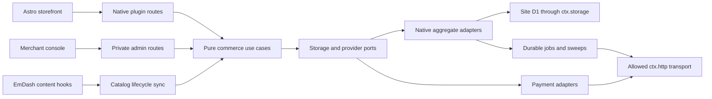

# Architecture and source map

## Ownership and execution

WSCommerce runs inside the EmDash CMS Worker on the reference site. There is no independent commerce service or second database. Each shop owns its deployment, D1 database, R2 media and provider credentials.



| State | Owner and rule |
| --- | --- |
| Titles, descriptions, media, slug, declared variant content | EmDash CMS; content hooks project lifecycle/title into commerce. |
| SKU, sellable variant price, price-tax mode, available stock | Native commerce; edit through merchant commands, not a CMS JSON stock field. |
| Cart holds, order quantities, financial/billing snapshots | Native commerce; captured historical evidence is immutable. |
| Provider settlement/refund result | Verified adapter signal plus guarded native state; redirects and HTTP acceptance are insufficient. |
| Invoice snapshot/job and provider document reference | Invoicing module; one selected invoice owner and durable reconciliation. |
| Woo numeric IDs, permitted metadata and delivery records | Compatibility module; projections do not become an independent financial source of truth. |

## Source map

| Area | Start here |
| --- | --- |
| Pure domain and branded money | [domain exports](../../packages/domain/src/index.ts), [money constructors](../../packages/domain/src/money/cents.ts), [ports](../../packages/domain/src/ports/payment-gateway.ts) |
| Checkout and frozen quantities | [create-order-from-cart](../../packages/domain/src/orders/create-order-from-cart.ts), [settle-order](../../packages/domain/src/orders/settle-order.ts) |
| Inventory invariants | [InventoryStore port](../../packages/domain/src/ports/inventory-store.ts), [native inventory adapter](../../packages/store-emdash/src/emdash-inventory-store.ts) |
| Native host boundary | [StorageAccess](../../packages/store-emdash/src/storage-access.ts), [CAS retries](../../packages/store-emdash/src/cas-retry.ts), [store composition](../../packages/plugin/src/commerce/in-process-commerce-stores.ts) |
| Storefront composition | [makeCommerceClient](../../packages/plugin/src/commerce/make-commerce-client.ts), [InProcessCommerceClient](../../packages/plugin/src/commerce/in-process-commerce-client.ts) |
| Merchant composition | [makeAdminClients](../../packages/plugin/src/admin/make-admin-clients.ts), [admin routing](../../packages/plugin/src/admin/admin-route.ts) |
| Plugin hooks/routes and capability perimeter | [plugin implementation](../../packages/plugin/src/plugin.ts), [manifest](../../packages/plugin/src/manifest.ts), [sandbox entry](../../packages/plugin/src/sandbox-entry.ts) |
| Provider integration composition | [site server entry](../../sites/staging/src/emdash-commerce-plugin.ts), [invoice wrapper](../../packages/plugin/src/integrations/invoices.ts), [Woo wrapper](../../packages/plugin/src/integrations/woocommerce.ts) |
| Storefront/theme HTTP boundary | [site README](../../sites/staging/README.md), [checkout endpoint](../../sites/staging/src/pages/checkout/place.ts), [origin guard](../../sites/staging/src/lib/origin-guard.ts) |
| CMS lifecycle and variants | [sync hooks](../../packages/plugin/src/sync/hooks.ts), [variant parsing](../../packages/plugin/src/sync/variants.ts) |
| Background recovery | [native cron](../../packages/plugin/src/cron/index.ts), [sweep legs](../../packages/plugin/src/cron/sweeps.ts) |

## Money and historical evidence

Use the public branded constructors; amounts carry an explicit currency:

```ts
import { cents, currency, money } from "@otta-sh/domain";

const price = money(cents(1800), currency("EUR")); // EUR 18.00
```

The current native money model is two-decimal minor units. `cents()` rejects negative, fractional and unsafe integers; presentation converts units at the boundary. A rate of 25% is 2,500 basis points. Do not use floating arithmetic to calculate captured line/order money.

Inclusive and exclusive inputs are reconciled into frozen line net/tax/gross evidence, discount allocation and shipping totals. Invoices and Woo exports use that evidence, never today's prices/rates or customer profile. A historical row lacking necessary tax proof must fail explicitly and be reconciled rather than reconstructed.

Payment state, refund state, fulfillment and invoice state are separate. A succeeded capture must match the frozen amount/currency. An unpaid COD dispatch state is not revenue; a pending/failed refund is not refunded money.

## Native storage and replay

The host supplies conditional document primitives through `ctx.storage`. One aggregate document contains the facts that must change atomically; compare-and-set retries resolve conflicts. Cross-aggregate work is made idempotently completable and swept. No raw SQL transaction, multi-document atomic commit or exactly-once external effect is assumed.

Each logical mutation gets a stable idempotency key. Retries of that intent reuse it; a later distinct merchant intent gets a fresh key even if its values return to a previous value. Do not delete replay witnesses to resume writes. Inventory adoption checks the order's frozen SKU/quantity, and the first guarded terminal reservation decision wins.

Stored-schema changes are forward migrations. Document compatibility/versioning and restoration before accepting them. Read [ADR-0019](../../adr/0019-commerce-aggregates-are-one-document-each.md) and [operations](../operations.md).

## Plugin and theme extension boundaries

`@otta-sh/plugin` uses standard-format Block Kit routes and restricted `ctx.http` egress. The separate native-format `otta-console` descriptor hosts React merchant pages and calls authenticated commerce routes. Trusted in-process deployment does not remove the sandbox/permissions contract.

Use the existing storefront/admin composition roots instead of independently constructing stores/gateways in theme pages. Theme POST routes enforce the browser origin, apply capability cookies and forward form idempotency keys. Public order capabilities are private bearer links, not permission to reveal operator-only details. Do not propagate those URLs to external Referer destinations.

A new native aggregate declares its storage collection/indexes in the host descriptor and plugs into the shared composition. A new provider must use the permitted transport and configuration model. Read [building integrations](integrations.md) before extending an IO seam.
