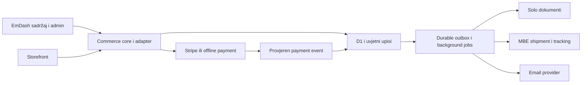

# EmDash commerce usporedba codebaseova

Pregled od 30. rujna 2026. obuhvaća lokalno preuzete DashCommerce, Ottu i WooCommerce, njihove relevantne razvojne grane te EmDash kao host. Cilj je odabrati osnovu za commerce paket koji možemo koristiti na više klijentskih projekata.

**Preporuka je fork Otte s odabranim razvojnim promjenama, uz WooCommerce kao funkcionalnu referencu.** Otta već ima razdvojenu domenu, adaptere, uvjetne upise, rezervacije i oporavak nakon prekida. DashCommerce ima širu deklariranu funkcionalnost, ali pregled checkouta, webhooks i zaliha otkriva ozbiljne nedostatke. Nijedan od ova dva EmDash projekta trenutačno ne pokriva cijeli webshop koji trebamo.

Ovo je završen lokalni pregled i integracijski pokus. Nije migracija acshopa niti potvrda produkcijskog rada. Nisu korišteni stvarni payment, Solo ili carrier ključevi; reprodukcije koriste lokalnu pohranu i zamijenjen HTTP transport.

## Preuzeti izvori

Sve kopije, dodatne grane, testovi i logovi nalaze se u lokalnoj, Gitom ignoriranoj mapi [commerce-audit](/Users/klukacin/projects/acshop/materials/commerce-audit/2026-09-30/sources-and-branches.json). JSON sadrži točne commitove, ancestry i popis promijenjenih datoteka.

| Projekt | Pregledana verzija i commit | Lokalni izvor |
| --- | --- | --- |
| DashCommerce | `0.2.0`, main `7666c14e1ccae5678dfa31403675e65b1b3ff23d` | [README](/Users/klukacin/projects/acshop/materials/commerce-audit/2026-09-30/sources/dashcommerce/README.md) |
| Otta | npm paketi `0.0.1`; descriptor `0.1.0`; main `7c63e6c2b21927b4760d396cc79da321de131f15` | [README](/Users/klukacin/projects/acshop/materials/commerce-audit/2026-09-30/sources/otta/README.md) |
| WooCommerce development | trunk `11.3.0-dev`, `bf2861944100fff0e1ff7eae8e56c3247e318bd0` | [README](/Users/klukacin/projects/acshop/materials/commerce-audit/2026-09-30/sources/woocommerce/README.md) |
| WooCommerce stable | tag `11.1.2`, `2316335b1bce366178ce865d4e61a4c5e2219352` | [plugin](/Users/klukacin/projects/acshop/materials/commerce-audit/2026-09-30/branches/woocommerce-11.1.2/plugins/woocommerce/woocommerce.php) |
| EmDash | tag `1.0.1`, `0e8977c221dd8e5111511eb226faa3d164c829ef`; dodatno dohvaćen main `18d6aa3f00f0c059df4207de921462b65c8c9413` | [host package](/Users/klukacin/projects/acshop/materials/commerce-audit/2026-09-30/sources/emdash/packages/core/package.json) |

DashCommerce i Otta imaju MIT licencu. WooCommerce root i manifesti navode GPL-2.0-or-later; njegov plugin README navodi GPLv3. Za naš MIT paket možemo zadržati MIT atribucije Otte i DashCommercea te neovisno implementirati ponašanja proučena u WooCommerceu. Kopiranje WooCommerce koda, testova i predložaka zahtijeva zasebnu odluku o licenci.

## Razvojne grane koje su uključene

Dohvaćeno je svih **5 upstream headova DashCommercea** i svih **164 upstream headova Otte**, s poviješću potrebnom za provjeru ancestry. Dodatno su preuzeti PR headovi iz forkova: običan fetch upstream branchova ih ne obuhvaća. Većina Otta branchova već je ancestor današnjeg maina; njihov naziv sam po sebi ne znači da funkcija nedostaje na mainu.

| Projekt i grana | Što donosi | Što to znači za nas |
| --- | --- | --- |
| DashCommerce [PR 28](https://github.com/emdashCommerce/dashcommerce/pull/28), `563d20b752aa0a61c10624152e7278b7636f993e` | EmDash 0.38 kompatibilnost, 3 commita ispred zajedničke baze i 11 iza današnjeg maina | Testovi, typecheck i Cloudflare build prolaze, ali runtime version guard još odbija eksplicitnu verziju 0.38. Nema podrške za EmDash 1.x ni popravaka pronađenih commerce grešaka. |
| DashCommerce [PR 18](https://github.com/emdashCommerce/dashcommerce/pull/18), `a9d62af9b4eca2ad43500d7a1a65b5235a0ed69d` | PaymentProvider, Stripe i mock adapter; fork, 36 commitova iza maina | 19 testova adaptera prolazi, ali checkout, webhook, refunds i subscriptions ne pozivaju novi registry. To je početak apstrakcije, ne dovršena podrška za drugi gateway. |
| DashCommerce [PR 27](https://github.com/emdashCommerce/dashcommerce/pull/27), `75a26f9cc597c51e743b6d465536962556055f95` | Verzije i changelog | Nema nove commerce funkcije. Ostale dvije upstream grane već su u mainu. |
| Otta [PR 322](https://github.com/UrumiAI/otta.sh/pull/322), `c83577a37d503fbc9391be1ef02ce17cdb83a4fa` | Pin EmDash 1.0.1 i peer range `>=1.0.1 <2.0.0` | Korisna polazna točka za aktualni host; široki peer range nije dokaz testiranja svih budućih 1.x verzija. |
| Otta [PR 326](https://github.com/UrumiAI/otta.sh/pull/326), `7f213081afa2ae7ed896a7aeb5418d5dee5dcf0e` | Prodaja SKU varijante, njezina cijena i snapshot u narudžbi | Main ima model varijanti, ali odbija njihovo dodavanje u cart. Grana otvara backend put; referentni PDP još treba selector varijanti. |
| Otta [PR 299](https://github.com/UrumiAI/otta.sh/pull/299), `2271db66b44cb6b4ef316d5faf2e3db7bf7294c6` | Uklanja dependency-cruiser reference na obrisani service | Korisno za održavanje CI nakon prelaska na commerce u CMS Workeru. |
| Otta `feat/aws-container-deploy`, `ci/e2e-gate`, `fix/price-input-validation` | Starije, nemergeane promjene za container/service model, E2E gate i commerce podatke u CMS formi | Pregledane su delte. Današnji main uklonio je zasebni commerce service i promijenio model podataka; ove grane nisu dobar skup za slijepi merge. Dvije preostale nemergeane upstream grane mijenjaju dokumentaciju. |
| WooCommerce trunk i stable 11.1.2 | Aktivni razvoj uspoređen s objavljenim coreom | Osnovne funkcije potvrđene su i u stable izvoru. |
| WooCommerce PR-ovi [69208](https://github.com/woocommerce/woocommerce/pull/69208), [69207](https://github.com/woocommerce/woocommerce/pull/69207), [69220](https://github.com/woocommerce/woocommerce/pull/69220), [69154](https://github.com/woocommerce/woocommerce/pull/69154), [69073](https://github.com/woocommerce/woocommerce/pull/69073) | Shipping filter redoslijed, delivery/pickup testovi, shipping tax, gateway settings i jednaka postcode validacija na UI/API | Dohvaćeni su konkretni headovi i pročitane promjene. Koristimo ih kao izvor scenarija za testiranje; razvojni PR nije tretiran kao objavljena funkcija. |

WooCommerce ima više od dvije tisuće udaljenih headova. Za njegov razvojni dio dohvaćeni su trunk i ovih pet relevantnih PR-ova, uz popis svih remote headova; nije provedena analiza svake povijesne WooCommerce grane.

## Usporedba funkcionalnosti

Oznaka „postoji” znači da je nađen implementirani put u kodu. Ne znači da je funkcija provedena kroz stvarnu naplatu, mail, račun i dostavu. Granice i dokazi razrađeni su u zasebnim pregledima [DashCommercea](/Users/klukacin/projects/acshop/materials/commerce-audit/2026-09-30/logs/dashcommerce-audit.md), [Otte](/Users/klukacin/projects/acshop/materials/commerce-audit/2026-09-30/logs/otta-audit.md) i [WooCommercea](/Users/klukacin/projects/acshop/materials/commerce-audit/2026-09-30/logs/woocommerce-audit.md).

| Funkcija | DashCommerce | Otta main i razvoj | WooCommerce core |
| --- | --- | --- | --- |
| Proizvodi, media, kategorije, SEO | CMS collection + commerce metadata | EmDash sadržaj, odvojeni commerce podaci | Postoji; WordPress sadržaj/media/taxonomy |
| SKU i zaliha varijanti | Postoje; cart/checkout ne provjerava ispravno pripadnost i aktivnost varijante | Model postoji; prodaja tek PR 326; PDP selector nedostaje | Postoji, s parent/variation stock pravilima |
| Grouped i external proizvodi | Schema/model postoje; grouped purchase flow nije završen | Nisu implementirani kao puni tipovi | Postoje; grouped nije isto što i bundle |
| Fizički i digitalni proizvodi | Download grants/redirect postoje; nema refund revocation ni privatnog file proxyja | Entitlements postoje; file delivery i automatsko ukidanje pristupa nakon refunda nisu završeni | Virtual/downloadable flags i download permissions |
| Server cart i guest checkout | Postoje; problemi sa stale popustima i dostavom | Postoje, s rezervacijama i capability tokenom | Postoje, session i persistent customer cart |
| Jednaki quote, order i payment totals | Ne prolazi pregled; reproducirani mismatch | Postoji zajednički pricing put, uz navedene tax/checkout greške | Bogat obračun i pohranjeni order totals |
| Stripe kartice | Hosted Checkout i Payment Element; lifecycle greške | PaymentIntent + Payment Element + potpisani settle | Zaseban Stripe/WooPayments plugin; nije core implementacija |
| Uplata na račun i pouzeće | Nema; PR 18 nije spojen u rute | Nema; payment method je stripe/x402 | BACS i COD u coreu |
| Payment retries i webhook dedupe | Event se označi prije dovršetka i retry se preskoči | Razrađeni idempotentni prijelazi, recovery i sweeps | Gateway ovisi o pluginu; core daje order/stock lifecycle |
| Stock rezervacije i konkurentne kupnje | Soft lock i read/put decrement; pronađeni race i own-hold problemi | CAS rezervacije/adoption/expiry; 2 potvrđene stock/checkout greške | Expiring reservation + InnoDB locking i DB decrement |
| Cijene s uključenim PDV-om | Tax modes postoje; flat/table naplata nije ispravno povezana | Tax-exclusive totals; bruto ulaz/display profil treba dodati | Inclusive/exclusive ulaz, display i rounding opcije |
| Porez prema lokaciji i klasi | Table helper postoji, resolver nije povezan u checkout | Zone/class rates; digital-only cart ostaje bez poreza | Lokacije, klase, compound rates, shipping tax i izuzeća |
| Kuponi | Više vrsta/eligibility; stale % coupon potvrđen | Fixed/% cart popust i limits; manja eligibility širina | Product/cart/%; kategorije, proizvodi, email, limits, individual-use |
| Shipping rates/zones | Flat/free/pickup/weight/class putovi; stale free shipping potvrđen | Flat/free + zone/destination pravila; nema pickup/weight metoda | Zones, flat/free/pickup, shipping classes/package rates |
| Narudžbe i financijski snapshot | Postoje; paid order može ostati bez items | Postoje, statusi, timeline, notes, cancellation i reconciliation | HPOS + immutable order-time line/tax/shipping podaci |
| Djelomični i puni refunds | UI i Stripe put postoje; lokalni status može ignorirati failed refund | Rezervacija refund iznosa postoji; Stripe status se ignorira | Refund records/restock; stvarni transfer ovisi o gatewayu |
| Tracking i fulfillment | Order workflow postoji; nije carrier booking | Jedna shipment/fulfillment evidencija po orderu; ručni tracking | Core partial fulfillments/tracking postoji, ali hidden/off-by-default |
| MBE booking, naljepnice, tracking sync | Nema | Nema | Zaseban carrier adapter/plugin |
| Solo računi, storno, usklađivanje | Nema | Nema | Zaseban Solo adapter/plugin |
| Kupci i account portal | Customer records i email-gated Stripe Billing Portal; puni account/address-book workflow nije potvrđen | Magic links i account/order stranice; address storage/API bez profile editora u referentnoj temi | Accounts, addresses, downloads, payment methods |
| Admin i ovlasti | EmDash admin UI; treba vlastiti commerce permission model | EmDash admin shell; treba commerce permission model | Shop manager/product/order/coupon/report capabilities |
| Transactional email | Predlošci i slanje postoje; nema durable outbox/retry, slanje može progutati grešku | Email outbox/retries + provider; konfiguracija nužna | Predlošci/events; WordPress transport treba konfigurirati |
| Izvještaji | Revenue/products/customers/MRR; truncation, mixed-currency i partial-refund računanje treba popraviti | Daily sales/status/top-product/low-stock rollups; nije accounting/tax/invoice ledger | Šira analytics i CSV report exports |
| Product CSV import/export | Nije potvrđen dovršen workflow | Nema dovršenog workflowa | Postoji; nije isto što i kompletan order/customer migration alat |
| GDPR export/delete i retention | Nije potvrđen kompletan workflow | Nema kompletnog commerce workflowa | Privacy export/erase/retention alati |
| Reviews/moderation | Postoji; public endpoint otkriva email | Nema | Postoji, verified-owner/moderation |
| Subscriptions i recurring billing | Postoje moduli; lifecycle nije prihvaćen za produkciju | Nema | Zaseban extension |
| Multivendor/commissions | Connect moduli, ograničenje jednog vendora po orderu | Nema | Zaseban extension |
| Multi-currency checkout | Price maps i currency minor-unit helper | Currency polja; Stripe odbija zero/three-decimal valute | Store/order currency; conversion/switcher zasebno |
| Cloudflare Workers | Bundle se gradi, traži patch i stariji host | Nativni CMS Worker + plugin storage/D1; lokalno provjeren 1.0.1 spoj | PHP/WordPress/MySQL origin; nije Workers-native |

## Greške koje utječu na odluku

### DashCommerce

**Checkout može naplatiti drugi iznos od prikazanog.** Lokalni primjer: artikl 1.000 centi, kupon 100 centi i 25% poreza daje quote 1.125 centi, a Hosted Checkout šalje Stripeu artikl od 1.000 centi. [checkout.ts:480](/Users/klukacin/projects/acshop/materials/commerce-audit/2026-09-30/sources/dashcommerce/packages/core/src/routes/checkout.ts:480) uzima originalni `unitPrice`, iako komentar kaže da je discount uključen. Table tax resolver nije povezan u taj put.

**Neuspjeli webhook ostaje označen kao obrađen.** [webhook.ts:69](/Users/klukacin/projects/acshop/materials/commerce-audit/2026-09-30/sources/dashcommerce/packages/core/src/routes/webhook.ts:69) zapisuje dedupe prije side effecta. Nakon prvog HTTP 500 ponovljeni event dobiva HTTP 200/duplicate, iako narudžba nije nastala. Slanje istog eventa ponovno iz Stripe dashboarda ne uklanja taj marker. Također je reproducirano da unpaid Checkout completion s processing PaymentIntentom stvara paid order.

**Arbitrarna varijanta može promijeniti cijenu drugog proizvoda.** Mock cart/checkout dokaz pokazuje artikl od 1.000 centi repriced na 100 centi preko neaktivne varijante koja pripada drugom proizvodu. Potrebna je server provjera product/variant/SKU veze i sellable statusa u cijelom putu.

**Paid order, stock i refund nisu pouzdano dovršeni zajedno.** Greška upisa items ostavlja paid order; retry preskače nedostajuće items. Mock paralelni decrement zadnje jedinice daje dvije prodaje. Failed Stripe refund lokalno postaje partially-refunded. Dodatno su reproducirani stale kupon/free-shipping, own-hold checkout retry, public review email leakage i subscription event-ordering problemi.

Ukupno je pokrenuto [14 lokalnih reprodukcija](/Users/klukacin/projects/acshop/materials/commerce-audit/2026-09-30/logs/dashcommerce-probes.test.ts); prolaz znači da se navedeno loše ponašanje dogodilo. Stock race koristi kontrolirani mock interleaving, a nije benchmark stvarnog D1. Svih 14 problema ponovljeno je i na PR-u 28, uz dvije dodatne provjere version guarda. PR 18 ne ispravlja checkout lifecycle; na njegovu kodu ponovljen je izvorni skup od 9 reprodukcija. Četiri zasebne adapter reprodukcije potvrđuju još unpaid-as-success, pogrešan refund reference, amount/idempotency i currency-format probleme.

### Otta

**Snapshot quantity i rezervacija mogu se razdvojiti nakon prekida.** Checkout spremi order za 2 knjige, prekid nastane prije adoptiona, a cart ostane promjenjiv. Kupac promijeni quantity na 1 ili 3 i ponovi checkout s istim ključem. Narudžba i naplata ostanu za 2 knjige, a stock se smanji za 1 ili 3 bez reconciliation flaga. To je potvrđeno preko stvarnog EmDash PluginStorageRepositoryja i migriranog lokalnog SQLitea, na mainu i našem razvojnom spoju. [create-order-from-cart.ts:152](/Users/klukacin/projects/acshop/materials/commerce-audit/2026-09-30/sources/otta/packages/domain/src/orders/create-order-from-cart.ts:152) već navodi taj follow-up; adoption uzima reservation IDs bez očekivanih quantity vrijednosti.

**Refund request nije isto što i dovršen refund.** [Stripe parser:974](/Users/klukacin/projects/acshop/materials/commerce-audit/2026-09-30/sources/otta/packages/payments-stripe/src/index.ts:974) uzima id, iznos i valutu, ali ne status. Za `pending`, `failed`, `canceled` i `requires_action` lokalna narudžba postaje refunded. [Stripeov opis refund objekta](https://docs.stripe.com/api/refunds/object) razlikuje te statuse. Potreban je lifecycle za čekanje, potvrdu i neuspjeh, uključujući refund evente ili reconciliation.

**Stock movement ima ograničen dedupe prozor.** Nakon prekida između povećanja stocka i označavanja movement claima kao applied, 256 novih stvarnih restockova istisne originalni ključ iz ringa. Retry originalnog restocka doda dodatnih 7 jedinica (273 → 280). Lokalno je potvrđen taj specifičan crash/replay scenarij. Komentari računaju na movement-claim sweeper koji nije uključen među aktualne cron legs. Ovo treba zatvoriti prije oslanjanja na dugotrajne queue retries i velike importe.

**Porezni model treba proširiti.** [quote.ts:83](/Users/klukacin/projects/acshop/materials/commerce-audit/2026-09-30/sources/otta/packages/domain/src/pricing/quote.ts:83) ignorira destination za digital-only cart; bez zone nema tax rates. [compute-totals.ts:46](/Users/klukacin/projects/acshop/materials/commerce-audit/2026-09-30/sources/otta/packages/domain/src/pricing/compute-totals.ts:46) dodaje porez na cijenu. Naš postojeći katalog koristi bruto cijene, pa se ovaj model ne smije prenijeti bez eksplicitne net/gross politike i testiranog roundinga.

Sedam [Otta reprodukcija](/Users/klukacin/projects/acshop/materials/commerce-audit/2026-09-30/scratch/otta-audit-probes/vitest.config.ts) potvrđuje prva tri problema. Nisu ispravljeni u okviru ovog pregleda.

## Lokalno korišten razvojni spoj Otte

Napravljen je zaseban worktree [otta-development](/Users/klukacin/projects/acshop/materials/commerce-audit/2026-09-30/branches/otta-development/package.json), grana `codex/audit-otta-development`. Polazi od pregledanog maina i uključuje:

1. `3bf1802` i `c83577a` iz PR 322 za EmDash 1.0.1.
2. Sam variant commit `7f21308` iz PR 326. Stariji parent commitovi u tom PR-u već imaju odgovarajuće promjene u današnjem mainu i nisu slijepo ponovno primijenjeni.
3. `2271db6` iz PR 299 za aktualnu dependency provjeru.

Riješena su četiri merge konflikta uz očuvanje novijih shipping/address provjera. Zadržani su novi variant testovi, a stari duplicirani shipping test block iz PR-a nije ponovno umetnut. Dvije lokalne prilagodbe testova dokumentiraju integraciju: port sada ima 28 metoda umjesto 27; D1 schema test provjerava prisutnost potrebnih revision triggera, dopuštajući dodatni redirect trigger iz EmDasha 1.0.1. To nisu popravci commerce grešaka niti promjene CMS hosta.

Finalni lokalni commit je `15ebd751c7302ad69bb2f4fecde003e756c9e505`, šest commitova iznad pregledanog upstream maina. Spoj nije poslan upstreamu niti deployan. Referentni PDP još šalje samo parent SKU u hidden inputu; backend podrška za varijantu nije dovršena UX podrška za odabir veličine/boje.

## Provedene provjere

| Izvor | Pokrenuto i rezultat | Granica zaključka |
| --- | --- | --- |
| DashCommerce main | Frozen Bun install; 103 upstream testa; typecheck; Node i Cloudflare build prolaze | Nema runtime deploy/Stripe potvrde; bundle traži stvarne D1/KV bindings |
| DashCommerce PR 28 | Frozen install, 85 testova, typecheck i Cloudflare build prolaze; 14 lifecycle i 2 compatibility probes potvrđuju defekte | Starija grana ima manje testova od maina; runtime guard još odbija 0.38, bez podrške za 1.x |
| DashCommerce PR 18 | 19 novih adapter testova prolazi; 9 lifecycle i 4 adapter probes reproduciraju greške | Provider nije povezan u operativne rute; nije pokrenut full build/typecheck grane |
| DashCommerce audit probes | 14/14 reproducira navedene probleme | Dokaz defekata, ne test suite koji dokazuje ispravnost |
| Otta main | Frozen pnpm install, lint, typecheck, recursive build; 551 lokalni D1 test prolazi | Remote PG i produkcija nisu dio tih provjera |
| Otta main full suite | Prvi run: 5.229 passed, 863 skipped, 1 todo, suite teardown timeout. Bounded retry: 5.228 passed, 1 failed, 863 skipped, 1 todo, drugi workerd cleanup timeout | Full suite nije zelen. Egress rerun: 4/4 pass; settings rerun: 20 pass/2 cleanup failures. Skipped PG testovi nisu „položeni” |
| Otta PR 326 | 18 odabranih domain/checkout-pipeline testova prolazi | Nije potpuni storefront pregled grane |
| Otta lokalni razvojni spoj | Frozen install, typecheck, lint, recursive build; 142/142 odabrana testa; 551/551 lokalni D1 test | Početne count/schema assertion greške otklonjene samo u lokalnom spoju, kako je opisano iznad |
| Otta audit probes | 7/7 na mainu; isti problemi potvrđeni i na lokalnom spoju (6 + 1 test) | Lokalni stvarni store i fault injection; Stripe HTTP mock, bez naplate |
| WooCommerce | Git/tag/source provjera, stable spot checks, test/CI pregled i 5 razvojnih PR-ova | PHP/Composer nisu dostupni; WP/PHP/checkout testovi nisu pokrenuti |
| EmDash | Pregled plugin API-ja i CAS implementacije; Otta spoj stvarno se gradi i izvršava D1 testove s objavljenim 1.0.1 paketima | Nije testirana svaka EmDash funkcija niti trenutni dev main |

Logovi i scratch skripte ostaju u audit mapi. Uspješan build i velik broj unit testova ne zamjenjuju operativni purchase/refund/invoice/shipment test.

## Što bih koristio za naš EmDash commerce

Predloženi oblik je vlastiti, verzionirani Otta fork s tankim EmDash adapterom i zajedničkim paketima. Svaki klijent u v1 ima svoj Worker, D1/R2 podatke i credentials. Tako više projekata koristi isti provjereni commerce kod, a release i podaci jednog klijenta imaju jasan opseg.

| Paket ili sloj | Odgovornost |
| --- | --- |
| `commerce-core` | Sellable proizvodi/varijante, jedinstveni pricing i tax pipeline, cart, zamrznuti order snapshot, stock, odvojeni payment/refund/fulfillment/invoice statusi |
| `commerce-emdash` | CMS collections/hooks, admin UI, host permissions, capability routes, plugin storage i schema/version kompatibilnost |
| `commerce-stripe` | Intents/Checkout, raw signature verification, amount/currency/order matching, retries, refund lifecycle i reconciliation |
| `commerce-offline-payments` | Uplata, HUB-3A i pouzeće; manual payment potvrda, stock/expiry pravila i COD surcharge |
| `commerce-solo` | Order-to-invoice mapping, document ID/status, storno/correction workflow, durable jobs i usklađivanje nepoznatog ishoda API poziva |
| `commerce-shipping` + `shipping-mbe` | Quotes, service izbor, booking, labels, cancellation, tracking i COD settlement; carrier ugovor/API treba potvrditi |
| `commerce-email` | Transactional templates, provider adapter, outbox, retries i evidencija dostave |
| `commerce-storefront` | Astro/React komponente za product/variant/cart/checkout/account; teme i client config ostaju izvan jezgre |

Postojeći Otta CAS/document adapter ostaje polazna implementacija. Namjenske tablice ili dodatna serializacija rezervacija uvode se tek prema mjerenju i jasno definiranim invariants. Queues je predloženi transport za background poslove; integracija queue consumera s CMS Workerom još nije implementirana ni potvrđena. Durable outbox i reconciliation potrebni su neovisno o odabranom transportu.

Stock concurrency dokaz mora koristiti konkretni D1 mehanizam, a ne prevesti WooCommerce InnoDB locking u običan read/save. [EmDash CAS implementacija](/Users/klukacin/projects/acshop/materials/commerce-audit/2026-09-30/sources/emdash/packages/core/src/database/repositories/plugin-storage.ts:187) uvjetuje update stvarnim revisionom. Cross-document operacije i vanjski provider side effecti traže završive, ponovljive korake i reconciliation.

## Redoslijed razvoja i prihvatni kriteriji

**1. Stabilna osnova.** Reproducirati i popraviti tri Otta greške; zamrznuti cart/order/hold količine; završiti variant PDP/cart put; definirati net/gross poreznu politiku i digital destination. Zadržati EmDash 1.x spoj i smanjiti sandbox teardown flakiness. Prihvat: isti ključ ne naplati/ne rezervira dvaput; paralelne kupnje zadnje jedinice imaju jedan dopušten ishod; order quantities i stock movements uvijek odgovaraju.

**2. Kompletan webshop za prvog klijenta.** Dodati uplatu/pouzeće/HUB-3A, shipping/pickup izbor, Solo i email adaptere, MBE integraciju kada imamo potvrđen API, admin za catalogue/stock/order/refund/shipment, granularne commerce ovlasti, product CSV import/export i customer export/erase. Prihvat: quote, Stripe naplata, order i Solo dokument imaju identične financial totals; ponavljanje posla ne stvara duplicirani dokument ili shipment; nepoznat provider ishod ostaje vidljiv operatoru.

**3. Pravi staging acceptance.** Cloudflare deploy, stvarni Stripe test checkout i refund, duplicate/out-of-order/late webhooks, expiry/retry, mail dostava, payment-state razlikovanje uplate/pouzeća, Solo testni dogovoreni tok i MBE shipment/label/tracking. Posebno testirati backup/restore i nadogradnju postojećih podataka. Ovi rezultati još ne postoje.

**4. Paket za više projekata.** Semver release, pinned dependency train, dvije različite demo trgovine, teme/locale/config odvojeni od jezgre, dokumentirane nadogradnje i mogućnost audita integracijskih problema. To je dokaz reusable platforme; kopiranje cijelog webshop repozitorija po klijentu ne daje isti maintenance model.

Reviews, subscriptions, bookings, multivendor, bundles, loyalty i currency conversion dodavao bih kao odvojene module kada ih projekt treba. WooCommerce core također ne uključuje sve te poslovne modele. Za početni shop najvažniji su ispravan novac, zaliha, narudžba, račun i isporuka.

## Što preuzeti iz kojeg projekta

Iz **Otte**: razdvajanje domene i IO adaptera, stock/order state machine, order snapshots, CAS store, testove prekida i konkurencije, email outbox i EmDash admin integraciju.

Iz **DashCommercea**: proučiti minor-unit currency helper, descriptor/scaffold, širinu product/discount/shipping konfiguracije i UI obrasce. Lifecycle za payment/order/stock/refund ne bih preuzimao bez prerade i regresijskih dokaza.

Iz **WooCommercea**: funkcionalni checklist i edge-case scenarije za net/gross porez, popuste, customer/session, offline payments, stock restore, refunds, shipping, role permissions, import/export i privacy. Core se oslanja na WordPress/PHP/MySQL; PHP plugin ne postaje EmDash plugin postavljanjem iza Cloudflarea.

Iz postojeće **acshop** aplikacije: katalog i naslovnice, hrvatski copy te postojeća poslovna pravila za bank/HUB-3A/COD. Trenutačni [database runtime](/Users/klukacin/projects/acshop/src/lib/db.ts:1) koristi lokalni filesystem i better-sqlite3; taj se runtime ne prenosi u Workers. Solo adapter nije implementiran. [Solo API dokumentacija](https://solo.com.hr/api-dokumentacija) daje invoice/offer/catalog metode, a payment/invoice policy i mapping moraju ostati eksplicitni u našem paketu.
